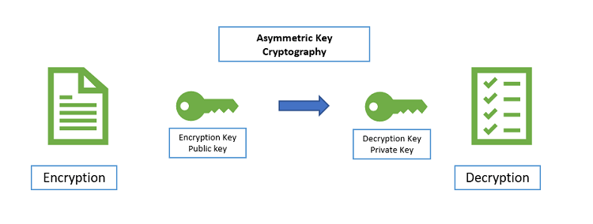

# Criptografia-Assimetrica
:computer: # Criptografia Assimétrica

## Aprenda o que é criptografia assimétrica, como funciona e o que faz

Quando se trata da palavra "criptografia", pensamos nela como uma técnica que protege dados usando uma chave criptográfica, e não há nada de errado com isso. No entanto, o que a maioria das pessoas não percebe é que existem diferentes tipos de métodos de criptografia. A criptografia assimétrica, também conhecida como criptografia de chave pública, é um exemplo de um tipo.

Ao contrário da criptografia “normal” (simétrica), a criptografia assimétrica criptografa e descriptografa os dados usando duas chaves criptográficas separadas, mas conectadas matematicamente. Essas chaves são conhecidas como ‘Chave Pública’ e ‘Chave Privada’. Juntas, são chamadas de ‘Par de Chaves Públicas e Privadas’.

Vamos ver como essas duas chaves funcionam juntas para criar a força formidável que é a criptografia assimétrica.

## Como funciona a criptografia assimétrica?
A criptografia assimétrica usa duas chaves distintas, mas relacionadas. Uma chave, a chave pública, é usada para criptografia e a outra, a chave privada, é usada para descriptografar. Conforme implícito no nome, a chave privada deve ser privada para que apenas o destinatário autenticado possa descriptografar a mensagem.

Vamos entender isso com um exemplo simples de criptografia assimétrica.

Finja que você é uma agência de espionagem e precisa criar um mecanismo para seus agentes se reportarem com segurança. Você não precisa de comunicação bidirecional, eles têm seus pedidos, você só precisa de relatórios regulares detalhados vindos deles. A criptografia assimétrica permitiria a criação de chaves públicas para os agentes criptografarem suas informações e uma chave privada na sede, que é a única maneira de descriptografar tudo. Isso fornece uma forma impenetrável de comunicação unilateral.

